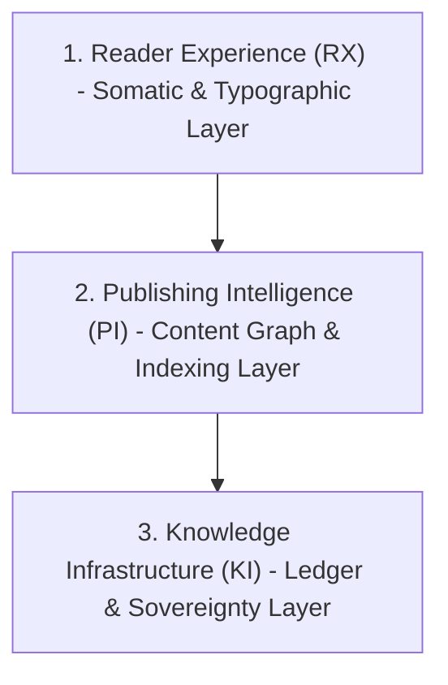

# Sovereign Intelligence Design Guide Specification

This specification documents the visual and structural design systems for the sovereign intelligence transmission layer, establishing protocols for typographic rhythm, color harmony, and information architecture.

---

## 1. The Three-Layer Information Architecture

The design of the sovereign intelligence ecosystem is structured around three distinct, interdependent layers. Each layer corresponds to a specific register of human-machine interaction and data provenance.



### 1.1 Reader Experience (RX)
The Reader Experience is the outermost visual and somatic surface. It governs the immediate physical interface through which the human reader interacts with theoretical text.
*   **Aesthetic Focus:** High-contrast layout, opinionated typography, and structural minimalism.
*   **Visual Philosophy:** The interface serves as a quiet canvas, avoiding typical SaaS dashboard patterns, noisy navigational widgets, and intrusive interactive elements. Its primary objective is the preservation of cognitive attention and reading flow.

### 1.2 Publishing Intelligence (PI)
The Publishing Intelligence layer handles the structural organization, indexing, and discoverability of content.
*   **Metadata Integration:** Translates raw Markdown and MDX frontmatter (such as lineage, taxonomy, explicit relations) into a unified, queryable content graph.
*   **Search and Retrieval:** Optimizes the corpus for both standard search engines (SEO) and LLM-based Answer Engines (AEO) by enforcing semantic indexing rules, category mapping, and provider biographies.

### 1.3 Knowledge Infrastructure (KI)
The Knowledge Infrastructure is the foundational verification and governance layer.
*   **Cryptographic Lineage:** Manages the append-only assurance ledger, execution gates, and permission management structures.
*   **Verification:** Ensures that all published documents, code assets, and transaction lineages are mathematically verifiable and independent of the cognitive plane's internal states.

---

## 2. The Single Design Test

Every component, style declaration, layout block, or visual asset must be subjected to a single diagnostic test:

$$\text{DesignDiagnostic}(e) \implies \text{If } e \text{ is removed, what reader outcome becomes worse?}$$

### 2.1 Enforcement Protocol
*   **The Default State:** The default state of any design element is non-existence.
*   **Validation Requirement:** An element (such as a border, button, gradient, or animation) is permitted only if its removal directly degrades reading comprehension, semantic navigation, or user trust in the mathematical provenance of the site.
*   **Eradication of Ornament:** If an element is purely decorative and its absence does not negatively impact a core reader outcome, it must be removed. This protocol prevents visual bloat and preserves the premium, archival tone of the platform.

---

## 3. Token System and Design Logic

The token system is not merely a collection of raw values: it is a visual representation of the underlying framework dynamics, specifically the interaction between the human sovereign ($\tau$) and the executing AI instruments ($\lambda$).

### 3.1 Color Palette Logic

The color palette is composed of four primary structural tokens, each representing a specific state of intelligence and system governance:

| Token Name | Conceptual Mapping | System Function |
| :--- | :--- | :--- |
| **Ember** | Active Transformation / Heat | Highlights, active execution gates, critical alerts, and primary interactive nodes. Signifies energy and crystallization. |
| **Sage** | Grounding / Systemic Stability | Positive verification states, complete actions, and stable governance indicators. Offsets the intensity of Ember. |
| **Gold** | Historical Provenance / Authority | Lineage signatures, sovereign badges ($\tau$-node indicators), and historical ledger verification. |
| **Ash** | Baseline Environment / Canvas | Foundational backgrounds, borders, low-contrast metadata, and secondary content blocks. Establishes the ambient environment. |

### 3.2 Typographic Hierarchy and Dynamic Tension

Typography is split between two contrasting faces to mirror the internal tension of governed intelligence:

```
                  +-----------------------------------+
                  |        TYPOGRAPHIC TENSION        |
                  +-----------------------------------+
                                    |
                  +-----------------+-----------------+
                  |                                   |
                  v                                   v
        [ Playfair Display ]                     [ DM Mono ]
          Human Sovereign                         AI Machine
         Editorial Gravity                     System Precision
```

*   **Playfair Display (Display & Headers):**
    *   *Usage:* Primary titles, section headings, and display blocks.
    *   *Logic:* As a premium, high-character serif typeface, Playfair Display carries historical, academic, and editorial weight. It signals to the reader that the content is a formal publication of theoretical value, emphasizing human-led intellectual depth ($\tau$).
*   **DM Mono (Metadata, Formulas, and Code):**
    *   *Usage:* Code snippets, JSON structures, transaction hashes, mathematical expressions, and database metadata.
    *   *Logic:* A clean, geometric monospaced typeface that represents the mechanical, automated, and verifiable components of the system ($\lambda$). Its presence grounds the editorial text in structural reality.

### 3.3 Spacing and Structural Rhythm

Spacing must not be applied arbitrarily. It is governed by a strict, scale-based proportion system:

*   **Scale Basis:** All margins, paddings, and line-heights are derived from root-em ($rem$) multiples: $0.5\text{rem}$, $1\text{rem}$, $1.5\text{rem}$, $2\text{rem}$, $3\text{rem}$, and $4\text{rem}$.
*   **Vertical Rhythm:** Block-level margins must align with the baseline typography grid to maintain reading momentum. Generous vertical spacing is reserved for separating major conceptual boundaries, while compact spacing is used within components to enforce cohesive context grouping.

---

## 4. The Atmospheric Design Principle and Scroll-Transition Constraint

The digital platform is designed as an ambient archive rather than a reactive software application. It must prioritize stability and focus over dynamic movement.

### 4.1 Atmospheric Principle
The interface should feel quiet, stable, and responsive to the user's presence without calling attention to itself. Visual elements should fade in softly or scale minimally, avoiding aggressive animations, parallax effects, or rapid state changes.

### 4.2 The Scroll-Transition Constraint

To prevent the degradation of reading focus, a strict threshold constraint is enforced on scroll-linked animations:

$$\text{ScrollTransitionsEnabled} = \text{true} \iff |\text{Corpus}| \ge 10$$

*   **The Rule:** No scroll-based transitions, dynamic scroll-linked animations, or custom parallax effects may be implemented in the frontend code before the active essay corpus reaches a minimum of 10 fully articulated essays.
*   **Rationale:** Scroll-linked transitions require a deep reading experience to justify their cognitive cost. On a shallow corpus, these transitions create "motion theater": distracting the reader from the scarce text and degrading performance for no functional benefit. Visual effort must scale proportionally with content volume.

---

## 5. Narrative Landmarks in Prose

In this framework, narrative landmarks are not CSS classes, visual badges, or UI breadcrumbs. They are a structural prose element.

### 5.1 Definition and Purpose
A narrative landmark is a single, clear, orienting sentence embedded directly within the text copy. It acts as a cognitive guidepost, helping the reader maintain spatial and conceptual orientation across complex, theoretical arguments.

### 5.2 Style and Implementation Guidelines
*   **Styling:** Landmark sentences must be set in the standard body font style. They must not use distinct visual boxes, accent colors, or italic formatting.
*   **Placement:** Placed at the transition boundary between major theoretical sections (for example, at the end of a section introduction or the start of a deep technical analysis).
*   **Example Structure:**
    > "Having established the mathematical limits of governed intelligence in Section 2, we now turn to the concrete execution patterns required to enforce them."
*   **Operational Goal:** To orient the reader through semantic prose clarity rather than visual noise.
