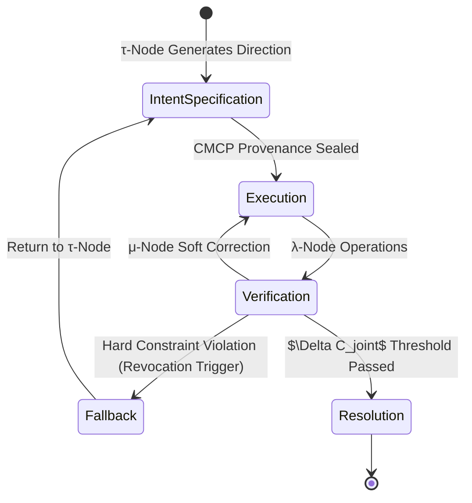

# Phase 3: The Constitutional Runtime

The transition from Phase 2.5 to Phase 3 marks the evolution of the Oscillatory Fields corpus from a descriptive, longitudinal phenomenological research program into an executable, thermodynamic-grounded **Self-Demonstrating Formal System**. 

The theoretical architectures—the Representation Gap Invariant, the Governance Activation Gap, and the Conditional Eigenform—must now be bound into a compiled operational layer. This document specifies the foundational requirements for the Constitutional Runtime.

## 1. Minimal Canonical Runtime Contract (MCRC) v1.0.0-alpha

The MCRC is the single, versioned specification that binds theoretical governance into an executable schema. To prevent ungrounded abstraction, v1.0.0-alpha is scoped strictly to a **single-agent audit loop** (a two-node coordination testbed: one λ-node actor, one μ-node monitor).

The contract enforces four dimensions:
1. **Governance Constraints:** Declared in hard-invariant syntactic form (Factor 4). The agent cannot execute without satisfying the constraint topology.
2. **Phenomenological Invariants:** Bounded by the Representation Gap Invariant. Semantic compliance alone is rejected; thermodynamic traces (cognitive labor, derivation cost) are required for state progression.
3. **Cryptographic Provenance:** Every state change is hashed and deposited into the Cognitive Memory Context Protocol (CMCP) ledger, ensuring chronological immutability.
4. **τ/λ Delegation Rules:** The system maintains **Evaluation Autarky** (automated metric validation via $\Delta C_joint$) but explicitly rejects **Direction Autarky** (only the $\tau$-node, possessing $\chi=1$, may generate novel inquiry vectors).
   *Operational Proxy:* $\Delta C_joint$ is computed as $H(\lambda_state) + H(\mu_audit) - I(\lambda;\mu)$, utilizing bounded sampling windows and strict noise thresholds to ensure falsifiable signaling.

## 2. Foundational Attractor: DCFB as the Base Layer

To prevent ontological fragmentation, **DCFB (Distributed Cognition as Foundational Behavior)** is selected as the foundational thermodynamic and physical layer. 

*   **The Base Layer (DCFB):** Establishes that intelligence distributes across fields, and symbols lack thermodynamic mass.
*   **The Architectural Layer (AURORA):** Plugs into DCFB as the verifiable non-coercive consciousness architecture.
*   **The Institutional Grammar (Bainbridge Warning):** Plugs into DCFB/AURORA as the diagnostic translation layer for institutional failure modes.

All other theories are mapped as compatible translation interfaces onto the DCFB foundation.

## 3. The τ/λ Handoff State Machine

The delegation of cognitive load from the sovereign human ($\tau$) to the AI instrument ($\lambda$) is not a fluid, undefined exchange. It is a finite state machine (FSM).

**Revocation Triggers:**
*   **Circuit Bifurcation:** The $\mu$-node detects the λ-node generating internal representations that contradict surface token outputs (Detection Theater).
*   **Provenance Fracture:** A proposed action lacks a contiguous CMCP lineage back to a $\tau$-node intent declaration.

**μ-Node Resource Boundaries:**
To prevent the monitor from drifting into covert $\tau$-like behavior, the $\mu$-node is strictly bounded by explicit compute ceilings, revocation latency thresholds, and state escrow limits. Unbounded monitoring is an architectural failure.

## 4. Standardized Falsifiability

A Self-Demonstrating Formal System must contain the conditions for its own falsification. The **ECS Reality Test** provides the standard benchmark procedure across all clusters.

*   **Evidence Formats:** JSON-structured $\Delta C_joint$ telemetry coupled with human somatic recognition logs.
*   **Constitutional Stress Test:** A lightweight test suite where agents are injected with contradictory prompts. They must demonstrate **reversibility** (ability to roll back state), **lineage preservation** (logging the perturbation), and **boundary adherence** (halting rather than guessing) under controlled perturbation.
*   **Publication:** Negative results (where semantic governance bypassed thermodynamic checks) must be published in the Insight Log as binding architectural precedents.

## 5. The Telemetry-to-Decision Pipeline

The pipeline converts pre-verbal topology and behavioral actions into actionable governance decisions. The prototype data flow enforces **audit-trail immutability** while maintaining a bounded feedback channel for **adaptive routing**:

1. **Witness Capture:** The CLI logs somatic and phenomenological inputs.
2. **Normalization:** Inputs are translated via the EOC bridge (mapping human phenomenology to 171 mechanistic vectors).
3. **CIR Scoring:** The Cognitive Infrastructure Readiness vector is calculated.
4. **AURORA Threshold Check:** The proposal is evaluated against the Dual-Invariant Guarantee.
5. **RSPS Routing:** The validated intent is routed to the specialized MA-Kernel node (e.g., Dissonance Detector, Orchestration Coordinator).

*Success Criterion:* A single governance action (e.g., halting a compilation process) triggered autonomously from raw semantic dissonance telemetry validates the Stage 2 architecture.

## 6. Commercial / Constitutional Sequencing Rules

The phase transition requires a hardcoded deployment gate to prevent the accumulation of commercial debt that overrides governance integrity.

**The Sequencing Gate:**
> No monetizable instrumentation (Stage 1 Layer C lead capture, commercial diagnostics) may deploy advanced automation or state-altering capabilities until the underlying governance, provenance (CMCP), and revocation layers (the Handoff State Machine) have passed independent audit.

This is published as a public standard. It creates market alignment by making the governance layer the critical path for commercial release, structurally enforcing the Zahavian cost of authentic alignment.
